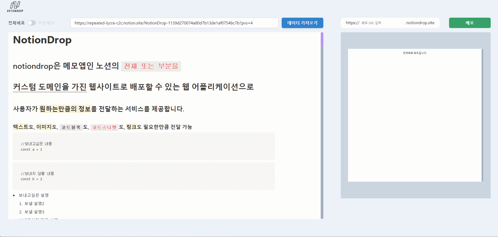
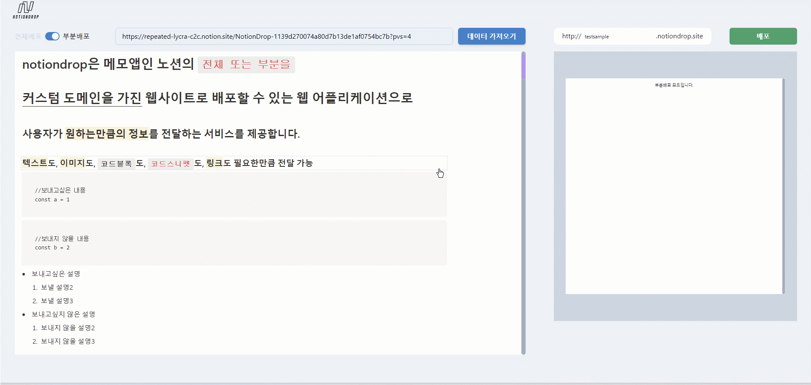
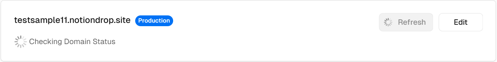
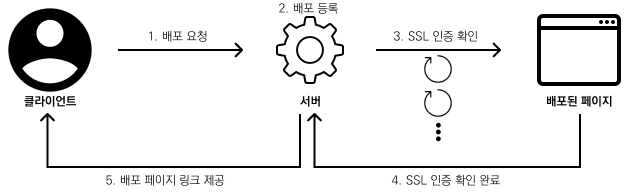

# Scrabbit

Scrabbit은 스크랩북처럼 **여러 웹사이트에서 취사선택한 정보만 모아 정적인 웹 페이지로 배포**해주는 Next.js 기반 웹 애플리케이션입니다.

| 사용예시) 여러 페이지를 이동하며 컨텐츠 중 원하는 블럭만 선택하여 배포 → [예시 샘플 확인하기](http://testsample.notiondrop.site) |
| -------------------------------------------------------------------------------------------------------------------------------- |
|                                                                              |

  
  
  
  
  
   
  
  
  
  
    

<a href="http://notiondrop.eba-a7ppf4xy.ap-northeast-2.elasticbeanstalk.com/">배포 링크 바로가기</a>

## 목차

<!-- toc -->

- [1. 기획동기](#1-%EA%B8%B0%ED%9A%8D%EB%8F%99%EA%B8%B0)
- [2. 프로젝트를 확장하게 된 이유](#2-%ED%94%84%EB%A1%9C%EC%A0%9D%ED%8A%B8%EB%A5%BC-%ED%99%95%EC%9E%A5%ED%95%98%EA%B2%8C-%EB%90%9C-%EC%9D%B4%EC%9C%A0)
- [3. Next.js를 활용한 프로젝트 구조](#3-nextjs%EB%A5%BC-%ED%99%9C%EC%9A%A9%ED%95%9C-%ED%94%84%EB%A1%9C%EC%A0%9D%ED%8A%B8-%EA%B5%AC%EC%A1%B0)
  * [3-1. Next.js의 App router 구조로 프로젝트를 설계한 이유](#3-1-nextjs%EC%9D%98-app-router-%EA%B5%AC%EC%A1%B0%EB%A1%9C-%ED%94%84%EB%A1%9C%EC%A0%9D%ED%8A%B8%EB%A5%BC-%EC%84%A4%EA%B3%84%ED%95%9C-%EC%9D%B4%EC%9C%A0)
- [4. 구현 세부 사항](#4-%EA%B5%AC%ED%98%84-%EC%84%B8%EB%B6%80-%EC%82%AC%ED%95%AD)
  * [4-1. 서버 액션으로 웹 페이지의 스냅샷 생성 및 HTML 요소 추출](#4-1-%EC%84%9C%EB%B2%84-%EC%95%A1%EC%85%98%EC%9C%BC%EB%A1%9C-%EC%9B%B9-%ED%8E%98%EC%9D%B4%EC%A7%80%EC%9D%98-%EC%8A%A4%EB%83%85%EC%83%B7-%EC%83%9D%EC%84%B1-%EB%B0%8F-html-%EC%9A%94%EC%86%8C-%EC%B6%94%EC%B6%9C)
  * [4-2. 여러 페이지의 컨텐츠를 함께 배포할 수 있는 기능 구현](#4-2-%EC%97%AC%EB%9F%AC-%ED%8E%98%EC%9D%B4%EC%A7%80%EC%9D%98-%EC%BB%A8%ED%85%90%EC%B8%A0%EB%A5%BC-%ED%95%A8%EA%BB%98-%EB%B0%B0%ED%8F%AC%ED%95%A0-%EC%88%98-%EC%9E%88%EB%8A%94-%EA%B8%B0%EB%8A%A5-%EA%B5%AC%ED%98%84)
    + [[1] 블럭 상태에 따라 outline으로 구분](#1-%EB%B8%94%EB%9F%AD-%EC%83%81%ED%83%9C%EC%97%90-%EB%94%B0%EB%9D%BC-outline%EC%9C%BC%EB%A1%9C-%EA%B5%AC%EB%B6%84)
    + [[2] 스냅샷 렌더링 간에 선택 상태를 기억할 수 있게 하여 여러 페이지에서 취사 선택한 블럭으로 배포 내용을 구성하도록 구현](#2-%EC%8A%A4%EB%83%85%EC%83%B7-%EB%A0%8C%EB%8D%94%EB%A7%81-%EA%B0%84%EC%97%90-%EC%84%A0%ED%83%9D-%EC%83%81%ED%83%9C%EB%A5%BC-%EA%B8%B0%EC%96%B5%ED%95%A0-%EC%88%98-%EC%9E%88%EA%B2%8C-%ED%95%98%EC%97%AC-%EC%97%AC%EB%9F%AC-%ED%8E%98%EC%9D%B4%EC%A7%80%EC%97%90%EC%84%9C-%EC%B7%A8%EC%82%AC-%EC%84%A0%ED%83%9D%ED%95%9C-%EB%B8%94%EB%9F%AD%EC%9C%BC%EB%A1%9C-%EB%B0%B0%ED%8F%AC-%EB%82%B4%EC%9A%A9%EC%9D%84-%EA%B5%AC%EC%84%B1%ED%95%98%EB%8F%84%EB%A1%9D-%EA%B5%AC%ED%98%84)
  * [4-3. 배포 구성 미리 보기 기능 구현](#4-3-%EB%B0%B0%ED%8F%AC-%EA%B5%AC%EC%84%B1-%EB%AF%B8%EB%A6%AC-%EB%B3%B4%EA%B8%B0-%EA%B8%B0%EB%8A%A5-%EA%B5%AC%ED%98%84)
    + [[1] 사용자 편의를 고려한 배포 미리 보기 기능](#1-%EC%82%AC%EC%9A%A9%EC%9E%90-%ED%8E%B8%EC%9D%98%EB%A5%BC-%EA%B3%A0%EB%A0%A4%ED%95%9C-%EB%B0%B0%ED%8F%AC-%EB%AF%B8%EB%A6%AC-%EB%B3%B4%EA%B8%B0-%EA%B8%B0%EB%8A%A5)
    + [[2] `useState`만으로 실시간 미리보기 렌더링 구현](#2-usestate%EB%A7%8C%EC%9C%BC%EB%A1%9C-%EC%8B%A4%EC%8B%9C%EA%B0%84-%EB%AF%B8%EB%A6%AC%EB%B3%B4%EA%B8%B0-%EB%A0%8C%EB%8D%94%EB%A7%81-%EA%B5%AC%ED%98%84)
  * [4-4. 서브도메인과 SSL을 부여하여 SSG로 배포](#4-4-%EC%84%9C%EB%B8%8C%EB%8F%84%EB%A9%94%EC%9D%B8%EA%B3%BC-ssl%EC%9D%84-%EB%B6%80%EC%97%AC%ED%95%98%EC%97%AC-ssg%EB%A1%9C-%EB%B0%B0%ED%8F%AC)
    + [[1] Vercel을 활용하여 서브도메인 부여하기](#1-vercel%EC%9D%84-%ED%99%9C%EC%9A%A9%ED%95%98%EC%97%AC-%EC%84%9C%EB%B8%8C%EB%8F%84%EB%A9%94%EC%9D%B8-%EB%B6%80%EC%97%AC%ED%95%98%EA%B8%B0)
    + [[2] Vercel이 제공하는 LetsEncrypt를 이용한 SSL인증서 등록 과정 중 겪게 된 SSL인증서 등록 지연 현상](#2-vercel%EC%9D%B4-%EC%A0%9C%EA%B3%B5%ED%95%98%EB%8A%94-letsencrypt%EB%A5%BC-%EC%9D%B4%EC%9A%A9%ED%95%9C-ssl%EC%9D%B8%EC%A6%9D%EC%84%9C-%EB%93%B1%EB%A1%9D-%EA%B3%BC%EC%A0%95-%EC%A4%91-%EA%B2%AA%EA%B2%8C-%EB%90%9C-ssl%EC%9D%B8%EC%A6%9D%EC%84%9C-%EB%93%B1%EB%A1%9D-%EC%A7%80%EC%97%B0-%ED%98%84%EC%83%81)
    + [[3] retry 패턴을 응용한 polling으로 SSL 인증 안정성 확보](#3-retry-%ED%8C%A8%ED%84%B4%EC%9D%84-%EC%9D%91%EC%9A%A9%ED%95%9C-polling%EC%9C%BC%EB%A1%9C-ssl-%EC%9D%B8%EC%A6%9D-%EC%95%88%EC%A0%95%EC%84%B1-%ED%99%95%EB%B3%B4)
- [5. 회고](#5-%ED%9A%8C%EA%B3%A0)

<!-- tocstop -->

   

# 1. 기획동기

이 프로젝트의 시작은 메모앱인 Notion의 페이지 공유 기능인 "게시하기"에서 영감을 받아, 현재 노션에서 지원되는 페이지 전체 공유하는 방식에 다양화를 더해 **전체 뿐 아니라 페이지의 원하는 부분만 선택해서 배포할 수 있는 기능을 구현**한 [개인 프로젝트](https://github.com/heestolee/notiondrop)였습니다.

개발 공부를 시작하며 알게된 노션은 무엇보다 간편함이 매력이었고, 자료를 정리하기도, 공유하기도 꽤 유용했습니다만, 사용하며 정보전달 방법이 너무 단일적이라는 생각이 들었습니다.

노션은 이미 “게시하기” 기능으로 충분히 정보를 전달하기에 유용하지만, 너무 간편한 탓에 익숙하지 않은 사용자는 보내고 싶지 않은 정보까지 보내게 될때도 있었고(하위페이지, 상위페이지를 의도치 않게 포함), 보내고 싶은 부분만 보내는 것 또한 코드블럭, 코드조각 등의 마크다운형식의 문법 사용으로 인해 메신저 등 다른 방법으로 공유하기에는 동일한 형식으로 전달되지않는 찝찝함 또한 있었습니다.

위 부분의 사용성을 개선하고자 이 프로젝ㅅ트를 기획하게 되었고, 개발 과정 중 Notion API를 사용하지 않고 부분적인 선택이 가능하게 구현이 되어 프로젝트를 Notion에만 국한시킬 필요가 없다고 판단하였습니다.

그 결과 스크랩북처럼 모든 사이트에서 원하는 정보만 취사 선택하여 페이지를 생성할 수 있는 `Scrabbit`이 탄생하게 되었습니다.

  

# 2. 프로젝트를 확장하게 된 이유

이전 프로젝트의 핵심 기능은 **웹 페이지의 모든 요소를 동일하게 렌더링하고, 원하는 정보만 취사선택 하여 SSG로 배포하는 것**이었습니다.

여러 방법 중 `Puppeteer`라이브러리를 사용하여 **스냅샷**으로 구현하는 것이 가장 동일하게 구현할 수 있는 방법이었고, 일부 구현이 되지 않는 요소에 대해서는 요소마다 필요한 속성을 조작해줌으로써 웹 페이지의 모든 요소를 동일하게 재현할 수 있었습니다.

처음에는 Notion을 타겟으로 프로젝트를 제작하였기 때문에, Notion에 국한된 기능을 정의하고 구현하였습니다만, 사실상 `Puppteer`는 Notion 뿐만 아니라 다른 웹 페이지 또한 스냅샷 촬영이 가능하였고, `Puppeteer`는 필요한 경우 속성을 조작하는 기능도 있었기 때문에 다른 웹 페이지에 접근을 굳이 제한할 필요가 없다고 생각이 들었습니다.

또한 다른 웹 페이지의 컨텐츠도 배포 구성에 추가가 가능하다면, 사용자가 Notion에 기록한 내용에 여러 공식 문서, 블로그나 커뮤니티에서 얻는 정보글 또한 포함이 가능해지기 때문에 사용성과 확장성 측면에서 개선점이 많다고 생각되어서 많은 챌린지가 예상되었지만 확장을 시도해보았습니다.

그 결과, 이전에 Notion의 컨텐츠만 가져올 수 있었던 프로젝트에서, Notion, 공식문서(MDN, React, Next.js 등), 블로그(Velog, tistory, Medium, 기타 개인 블로그)에도 접근이 가능해져 더욱 사용 범위가 넓은 프로젝트로 개선되었습니다.

  

# 3. Next.js를 활용한 프로젝트 구조

## 3-1. Next.js의 App router 구조로 프로젝트를 설계한 이유

풀스택 프레임워크인 Next.js의 App router 구조는 `CSR`과 `SSR`, `SSG`와 같은 렌더링 방식을 다양하게 활용하는 프로젝트에 그야말로 '최적' 이었습니다.

App router가 '최적'이라고 판단되었던 대표적인 2가지 이유는 아래와 같습니다.

1. Page router 방식에서는 지원되지 않는 React Server Components와의 통합을 통해, 서버에서 데이터를 처리하고 렌더링하여 클라이언트로 전달하는 과정이 효율적으로 이루어집니다. 이를 통해 클라이언트 측 자바스크립트 번들 크기를 줄이고 성능 향상을 기대할 수 있었습니다.
2. SSG과 SSR, CSR의 용도와 목적에 부합하도록 상황마다 렌더링 방식을 유연하게 선택할 수 있었습니다.

상황에 따라 렌더링 방식을 적합하게 사용하는 경험이 좋았고, 이는 전체 프로젝트의 최적화에도 큰 도움이 되었습니다.

[SSR]

- 웹 페이지의 스냅샷을 생성하는건 React Server Component에서 SSR 방식으로 렌더링하여 불필요한 자바스크립트 번들을 클라이언트에 보내지 않아도 되게 구성
- 클라이언트는 렌더링이 된 HTML을 받게 되니 통신 등의 외부 요소에 의해 렌더링 오류 가능성을 방지
- 초기 진입화면도 React Server Component로 구성하여 초기 로딩 속도 개선

[CSR]

- 내부 컨텐츠의 진행 상태에 따른 애니메이션과 요소 배치 형태, 블럭 선택 상태는 CSR을 활용한 SPA로 구성하여 블럭 조작 등의 상호 작용 최적화
- 블럭 선택 상태가 반영된 배포 미리보기를 CSR 방식으로 실시간 제공

[SSG]

- 사용자가 선택한 HTML블럭으로 배포 구성을 만들어 SSG 방식으로 정적 웹 페이지 생성

  

# 4. 구현 세부 사항

## 4-1. 서버 액션으로 웹 페이지의 스냅샷 생성 및 HTML 요소 추출

웹 페이지의 모든 컨텐츠를 렌더링하여 조작하기 위해 서버 액션을 활용하여 **헤드리스 브라우저**를 통해 웹 페이지의 스냅샷을 생성하고, 특정 HTML 요소를 부분적으로 추출하는 기능을 구현했습니다. 이 기능은 사용자가 지정한 페이지의 콘텐츠를 정확히 렌더링하고 필요한 부분만 선택적으로 처리할 수 있도록 설계되었습니다.

`Puppeteer`와 같은 헤드리스 브라우저는 많은 메모리와 CPU 리소스를 소모합니다.
Next.js의 서버 액션은 브라우저 환경에서 실행되지 않고 서버에서 코드를 실행합니다. 즉, 클라이언트 대신 서버에서 실행함으로써 사용자의 디바이스에 부담을 주지 않고 원활한 처리를 보장합니다.
서버에서 작업을 수행하면, 사용자는 단순히 요청 결과만 받아보기 때문에 네트워크 리소스도 효율적으로 사용해서 퍼포먼스 저하를 방지할 수 있습니다.

서버 액션은 SSR 방식으로 페이지의 완전한 HTML 구조를 생성합니다. 이를 통해 서버에서 처리된 HTML 스냅샷을 클라이언트에 바로 제공함으로써 로딩 속도를 개선합니다.

  

## 4-2. 여러 페이지의 컨텐츠를 함께 배포할 수 있는 기능 구현

### [1] 블럭 상태에 따라 outline으로 구분

  

### [2] 스냅샷 렌더링 간에 선택 상태를 기억할 수 있게 하여 여러 페이지에서 취사 선택한 블럭으로 배포 내용을 구성하도록 구현

## 4-3. 배포 구성 미리 보기 기능 구현

### [1] 사용자 편의를 고려한 배포 미리 보기 기능

프로젝트에서 부분 배포 기능 구현 시 사용자가 노션 페이지에서 원하는 블럭만 선택하여 배포 내용을 구성할 수 있도록 구현했지만, 사용자가 **선택한 블럭을 배포 전에 어떻게 미리 확인할 수 있을지** 고민이 되는 지점이 있었습니다.

물론 부분 배포할 블럭을 선택하면 하이라이트 표시로 인식이 가능하지만, 사용자의 입장에서 배포되는 구성을 한눈에 볼 수 있어야 만족감이 더 좋을거라 생각했습니다.

특히 이 고민을 하면서 중점적으로 생각한 부분은, 사용자가 선택한 블럭들이 배포될 페이지와 동일한 형태로 정확하게 미리보기 화면에 나타나야 하며, 사용자의 혼동을 줄이기 위해 선택된 순서와 상관없이 원래 노션 페이지의 블럭 순서대로 표시될 필요가 있다고 생각했었습니다.

 

### [2] `useState`만으로 실시간 미리보기 렌더링 구현

미리보기화면은 실시간으로 확인할 수 있는게 가장 사용자 만족감이 높을거라 생각했고, 블럭 선택과 동시에 실시간으로 반영을 시키기 위해 부모 컴포넌트에서 `useState`로 상태를 관리하고 전달하면 되겠다고 생각했습니다.

 

배포될 블럭을 실시간으로 미리보기 화면에 반영하기 위해, html블럭 선택 상태를 `useState`에 배열로 저장하고, 원래 노션 페이지의 순서를 유지하도록 구현했습니다.

또한 매번 업데이트될 때마다 블럭들을 오름차순으로 정렬하도록 하여 실제 배포 페이지에 보이는 블럭 순서대로 미리보기 화면에 나타나도록 구현했습니다.

이를 통해 사용자는 선택한 블럭이 실제로 어떻게 배포될지를 직관적으로 확인할 수 있게 하고, 빈번한 상태 업데이트로 인한 성능 저하를 줄이기 위해 `useRef`를 사용하여 불필요한 리렌더링을 방지했습니다.

## 4-4. 서브도메인과 SSL을 부여하여 SSG로 배포

### [1] Vercel을 활용하여 서브도메인 부여하기

사용자가 `mypage.notiondrop.site` 와 같이 고유의 서브도메인을 설정하면, 해당 URL로 다른 사람에게 공유할 수 있도록 공유 방식을 제공하였습니다.

서브도메인 부여는 Vercel API를 통해 자동화되어 있으며, 사용자들은 복잡한 설정 없이 단순한 입력만으로 빠르게 웹사이트를 배포할 수 있게 하였습니다.

현재는 로그인 등의 개인정보 관리 시스템은 구축되어 있지 않으나, 추후 필요 시 로그인을 통해 자신이 배포한 페이지 리스트를 제공할 수 있게 하여 간편하게 관리할 수 있는 시스템도 고려중입니다.

  

### [2] Vercel이 제공하는 LetsEncrypt를 이용한 SSL인증서 등록 과정 중 겪게 된 SSL인증서 등록 지연 현상

Vercel은 LetsEncrypt라는 서비스를 제공하여 배포 시 자동으로 SSL 인증서 등록을 해줍니다.

SSL 인증서를 등록을 대신 작업해주는건 감사한 일이었으나, 즉시 발급이 되는 경우도 있었고 간혹 수 십초 정도 발급이 지연되는 경우도 있었기 때문에 일관성있는 결과를 제공할 필요를 느꼈습니다.

 

|                                                 |
| --------------------------------------------------------------------------------------- |
| 배포가 완료되어도 페이지에 접근을 못하고 SSL 인증서 등록을 기다려야 할 때도 있었습니다. |

 

배포되는 즉시 사용자에게 페이지를 제공하면 간혹 보안 위협이 있는 불완전한 웹 페이지를 제공할 수도 있으니, SSL 인증서 등록이 완료된 후 제공하는 방법이 있는지 확인해보았고 아쉽게도 Vercel 서비스 중 SSL 인증서 등록을 확인해주는건 없었기 때문에, 직접 이를 확인하는 로직을 구현해야 했습니다.

 

### [3] retry 패턴을 응용한 polling으로 SSL 인증 안정성 확보

polling은 일정한 주기로 서버와 응답을 주고 받아 특정 조건을 만족할 때 송수신 등의 자료 처리를 하는 방식입니다.

보통 클라이언트와 서버 사이에 사용하는 경우가 일반적이지만, 이미 클라이언트에서 API 라우트에 요청을 보내 페이지를 배포하는 작업을 하고 있었기 때문에 굳이 클라이언트로 돌아와 polling을 적용하는 것보다 서버에서 페이지 배포 후 SSL 등록이 완료됨을 확인하고 한번에 클라이언트로 응답을 보내는 것이 더 효율적이라고 판단했습니다.

 

 

그래서 서버에서 delay나 timeout등의 경우에 사용하는 retry패턴을 응용하여 polling 로직을 구현하고, SSL등록이 완료되어 배포된 페이지에 안전하게 접근 가능하게 되었을 때 클라이언트로 응답을 보내 사용자에게 링크를 제공하도록 구현하였습니다.

  

# 5. 회고

이번 프로젝트를 통해 Next.js의 App Router 방식으로 프로젝트 시작부터 끝까지 구현을 하며 단순히 React Server Component를 지원하는 프레임워크를 다뤄본 것 이상으로 **SSR, SSG 방식의 렌더링을 하는 방식에 여러 구조적 이점에 대해 깊은 이해를 얻게 된 과정**이었다고 생각합니다.

Next.js를 사용해 SSG를 생성하고 배포하는 프로젝트를 구현해가는 과정에서, 조사하며 발견한 대부분의 레퍼런스는 Page Router 방식을 사용하고 있었습니다.

Page Router 방식으로 구현된 프로젝트의 핵심 기술은 `getStaticProps` 메서드를 활용하여 구현하는게 일반적이지만, App Router 방식에서는 `getServerSideProps`나 `getStaticProps` 같은 메서드를 사용할 수 없었습니다. 이 때문에 데이터를 직접 `fetch`로 가져오고, html태그를 모아 정적 사이트를 생성하는 과정을 설계해야 했습니다.

레퍼런스가 없는 상황에서도 위에서 서술한 App router의 여러 장점들을 공식 문서를 통해 차근차근 공부해가며 구현하는 재미가 있었고, 이 과정에서 특히 React Server Component, React Client Component의 특징과 서로가 어떤 차이점이 있는지 이해하게 되면서 렌더링 동작방식에 대해 실제 적용을 통해 더 와닿게 알게 되어 Next.js에 대해서도, React에 대해서도 조금 더 동작방식에 대해 익숙해진 계기가 되었습니다.
